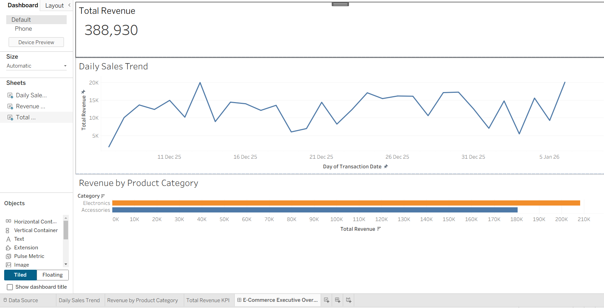

# 🛒 End-to-End E-Commerce ELT Pipeline

## 📌 Project Overview
This project is an automated **ELT (Extract, Load, Transform)** pipeline that simulates a high-volume e-commerce platform. It generates synthetic transaction data, stores it in a **Data Lake (AWS S3)**, loads it into a **Data Warehouse (PostgreSQL on RDS)**, and transforms it into a Star Schema for analytics.

The final output is an interactive **Tableau Dashboard** that provides executive-level insights into sales trends, product performance, and revenue KPIs.

## 🏗️ Architecture
The data flows through the following stages:

**`Source (Python)`** $\rightarrow$ **`AWS S3 (Raw Storage)`** $\rightarrow$ **`PostgreSQL (Staging)`** $\rightarrow$ **`PostgreSQL (Fact Table)`** $\rightarrow$ **`Tableau (Visuals)`**

## 🛠️ Tech Stack
* **Language:** Python 3.9+ (Pandas, Boto3, SQLAlchemy, Psycopg2)
* **Cloud Storage:** AWS S3 (Simple Storage Service)
* **Data Warehouse:** AWS RDS (PostgreSQL)
* **Orchestration:** Apache Airflow (DAG included)
* **Visualization:** Tableau Desktop
* **Security:** Environment Variables (`python-dotenv`) for credential management

## 🚀 Key Features
* **Automated Ingestion:** Generates and uploads realistic transaction data with 30-day history to S3.
* **Cloud Data Lake:** Decoupled storage using AWS S3 for raw file retention.
* **Dimensional Modeling:** SQL transformations convert raw string data into a strict **Fact Table** schema with proper data typing.
* **Security Best Practices:** All credentials are managed via `.env` files and excluded from version control.
* **Orchestration Ready:** Includes an Airflow DAG (`airflow_dag.py`) to schedule the pipeline daily.

## 📊 Dashboard
The final Tableau dashboard provides insights into:
* **Total Revenue KPI**
* **Daily Sales Trends** (Time-series analysis)
* **Revenue by Product Category**




## 📂 Project Structure
```text
Ecommerce-ELT-Pipeline/
│
├── 1_data_generator.py      
├── 2_setup_database.py      
├── 3_etl_pipeline.py        
├── airflow_dag.py           
├── requirements.txt         
├── .env                     
└── README.md                
